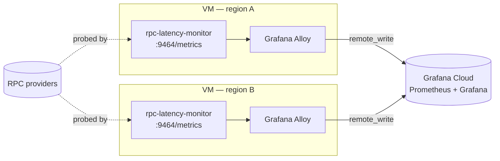

<h1 align="center">rpc-latency-monitor</h1>

<p align="center">
  <strong>Neutral, read-only latency monitoring for Solana RPC providers.</strong>
</p>

<p align="center">
  <a href="https://github.com/solana-foundation/rpc-latency-monitor/actions/workflows/ci.yml"></a>
  <a href="./LICENSE"></a>
  
</p>

---

`rpc-latency-monitor` continuously probes Solana RPC providers from multiple regions, times every
request, and publishes the results as Prometheus metrics rendered in Grafana. It is the measurement
backbone of the Solana Foundation's **VIP Trading Program**: a way to benchmark provider read
performance neutrally and transparently, rather than relying on numbers self-reported by any single
provider.

## What & Why

The Foundation acts as an **independent measurement party**. We do not run RPC infrastructure
ourselves; we measure it. Every provider is probed the same way, from the same vantage points, with
the same checks, and the methodology is open for anyone to inspect.

For each configured provider, the monitor runs a set of read RPC checks on independent loops, times
each request, and records:

| Metric | Type | Meaning |
| --- | --- | --- |
| `rpc_latency_seconds` | histogram | Wall-clock round-trip latency, labeled by `provider`, `method`, `status`. |
| `rpc_slot_lag` | gauge | How many slots a provider trails the observed chain tip, by `provider`, `method`. |
| `rpc_requests_total` | counter | Request outcomes by `provider`, `method`, `status`, `error_kind`. |
| `rpc_up` | gauge | Whether a provider's most recent check succeeded. |

Every series also carries a `region` label so latency can be compared from each vantage point.

> **Scope (v0):** read-only RPC latency and slot lag. Not yet in scope: transaction
> sending / landing-service latency, a recommendation API, or a multi-provider SDK.

## Architecture

The monitor is a single, small Rust binary. It owns no shared mutable state beyond an atomic
"chain tip" slot and a most-recent-signature cache, so each check runs on its own Tokio task and
loop. Metrics are exposed in Prometheus text format on a local `/metrics` endpoint; a colocated
[Grafana Alloy](https://grafana.com/docs/alloy/) agent scrapes that endpoint and `remote_write`s to
Grafana Cloud.

```
                Region: us-east4              Region: europe-west2          Region: asia-northeast1
            ┌──────────────────────┐      ┌──────────────────────┐      ┌──────────────────────┐
            │  GCP VM (COS)        │      │  GCP VM (COS)        │      │  GCP VM (COS)        │
            │                      │      │                      │      │                      │
   probes   │  rpc-latency-monitor │      │  rpc-latency-monitor │      │  rpc-latency-monitor │
  ┌──────┐  │   │  :9464/metrics   │      │   │  :9464/metrics   │      │   │  :9464/metrics   │
  │ RPC  │◄─┤   ▼                  │      │   ▼                  │      │   ▼                  │
  │ prov │  │  Grafana Alloy       │      │  Grafana Alloy       │      │  Grafana Alloy       │
  └──────┘  └──────────┬───────────┘      └──────────┬───────────┘      └──────────┬───────────┘
                       │ remote_write                │                              │
                       └─────────────────────────────┼──────────────────────────────┘
                                                      ▼
                                         ┌─────────────────────────┐
                                         │      Grafana Cloud       │
                                         │  (Prometheus + Grafana)  │
                                         │   dashboards / panels    │
                                         └─────────────────────────┘
```



The "tip" slot used for slot-lag is, by default, the **max `processed` slot observed across all
providers** — so the reference depends on no single provider. Optionally a dedicated endpoint can be
polled for the reference slot instead.

## Quickstart (local)

Requires a recent stable Rust toolchain (see [`rust-toolchain.toml`](./rust-toolchain.toml)).

```bash
cp config.example.yaml config.yaml      # edit providers / checks / region

# Provider credentials are substituted into ${ENV_VAR} placeholders in config.yaml.
cp .env.example .env                     # fill in HELIUS_API_KEY, etc.
set -a; source .env; set +a

cargo run --release -- --config config.yaml
curl localhost:9464/metrics
```

Secrets are kept out of the config file: provider URLs use `${ENV_VAR}` placeholders that are
resolved from the environment at startup, and the URLs are redacted in logs. In deployed
environments those values come from [Doppler](https://www.doppler.com/); locally a `.env` is the
fallback.

Or bring up the full local stack (monitor + Prometheus + Grafana, dashboard auto-provisioned at
<http://localhost:3000>):

```bash
cp config.example.yaml config.yaml       # mounted into the monitor container
docker compose -f deploy/docker-compose.yaml up --build
```

## Configuration

Full reference: [`config.example.yaml`](./config.example.yaml). Durations accept humantime strings
(`"500ms"`, `"2s"`, `"1m"`). Top-level keys:

| Key | Description |
| --- | --- |
| `region` | This instance's region tag, applied as a label to every metric. On GCP it is overridden by `MONITOR_REGION`, derived from the VM's zone metadata. |
| `server.bind` | Address for the Prometheus `/metrics` and `/health` endpoints (default `0.0.0.0:9464`). In production, bind to `127.0.0.1` so only the local Alloy agent can scrape. |
| `reference_slot.source` | `max_observed` (neutral; highest `processed` slot seen across providers) or `endpoint` (poll a dedicated RPC). |
| `reference_slot.endpoint` / `poll_interval` | Optional dedicated endpoint and poll cadence, required when `source: endpoint`. |
| `providers[]` | List of `{ name, url }`. `url` may contain `${ENV_VAR}` placeholders. Names must be unique. |
| `checks[]` | List of `{ method, interval, jitter }`. Each check runs on its own loop; `jitter` randomizes the period to avoid thundering herds. |
| `request_timeout` | Per-request timeout for outbound RPC calls (default `10s`). |

### Providers

Each provider is a name plus a URL. Credentials live only in the environment:

```yaml
providers:
  - name: helius
    url: "https://mainnet.helius-rpc.com/?api-key=${HELIUS_API_KEY}"
  - name: triton
    url: "https://${TRITON_HOST}/${TRITON_TOKEN}"
  - name: quicknode
    url: "${QUICKNODE_URL}"
```

### Checks

The read methods currently supported (the `method:` value, mapped to its JSON-RPC call):

| Check | JSON-RPC call | Notes |
| --- | --- | --- |
| `get_health` | `getHealth` | Liveness only. |
| `get_slot` | `getSlot` | `processed` commitment; feeds the reference tip. |
| `get_latest_blockhash` | `getLatestBlockhash` | `processed`; reports context slot. |
| `get_account_info` | `getAccountInfo` | System program account, `processed`. |
| `get_program_accounts` | `getProgramAccounts` | Token-program GPA with `memcmp` + `dataSlice` filters. |
| `get_block_recent` | `getBlock` | A recent block at a fixed confirmation depth behind the tip. |
| `get_transaction_recent` | `getTransaction` | A signature freshly discovered by `get_signatures_for_address`. |
| `get_signatures_for_address` | `getSignaturesForAddress` | High-traffic address; seeds `get_transaction_recent`. |

### Regions

Regions are defined for deployment in Terraform's `locations` map (region label → zone). The default
fleet spans North America, Europe, and Asia:

```
us-east4   us-west2   europe-west2   europe-west3
asia-northeast3   asia-northeast1   asia-southeast1
```

Add or remove vantage points by editing the `locations` map in
[`deploy/gcp/terraform/variables.tf`](./deploy/gcp/terraform/variables.tf).

## Deployment

Multi-region on GCP: one small Container-Optimized OS VM per region (`e2-small` by default), each
labeled with its region and running the monitor plus an Alloy agent. See
[`deploy/gcp/README.md`](./deploy/gcp/README.md) for the standalone Terraform flow.

The CI/CD pipeline ([`.github/workflows/deploy.yml`](./.github/workflows/deploy.yml)) runs on push
to `main` (or via manual dispatch with a `gcp` / `grafana` / `all` target):

```
push to main
   │
   ▼
verify (cargo fmt --check · clippy -D warnings · test)
   │
   ▼
authenticate to GCP via Workload Identity Federation (WIF, no static keys)
   │
   ▼
Cloud Build → container image pushed to Artifact Registry  (deploy/cloudbuild.yaml)
   │
   ▼
terraform apply  → reconcile the per-region VM fleet        (deploy/gcp/terraform)
   │
   ▼
staggered VM reset  → reset one VM at a time (RESET_DELAY between each)
                      so vantage points roll without a fleet-wide gap
   │
   ▼
Slack notifications: started / succeeded / failed
```

Secrets (provider keys, Grafana Cloud `remote_write` credentials, the VM Doppler token) are sourced
from Doppler at deploy time and pulled on the VM at boot — Terraform only ever sees a single Doppler
service token.

## Dashboards

Dashboards live in [`grafana/`](./grafana) and are pushed to Grafana Cloud as part of a deploy (the
`grafana` / `all` targets). The primary board, **RPC Latency Monitor**
([`grafana/dashboard.json`](./grafana/dashboard.json)), has panels for:

- **p99 latency by provider** (templated by `$method`)
- **p50 latency by provider** (templated by `$method`)
- **Slot lag by provider**
- **Win % by provider** (templated by `$method`, `$region`)

A second board, **Sender** ([`grafana/sender-dashboard.json`](./grafana/sender-dashboard.json)),
tracks provider economics for the trading program.

Scrape and `remote_write` are configured in [`grafana/alloy-config.alloy`](./grafana/alloy-config.alloy)
(15s scrape of `127.0.0.1:9464`, forwarding to Grafana Cloud via `GRAFANA_CLOUD_*` env vars).

## Methodology

The measurements are designed to be neutral and reproducible:

- **Fresh, no-cache probes.** Every request sets `Cache-Control: no-cache` and `Pragma: no-cache`,
  and queries are constructed to defeat trivial caching — e.g. `get_transaction_recent` chases a
  signature freshly surfaced by `get_signatures_for_address`, and `get_block_recent` targets a moving
  slot a fixed depth behind the tip. We measure live read performance, not cache hits.
- **Win %.** For a given method and region, the dashboards compute how often each provider was the
  fastest responder, complementing raw p50/p99 latency so a provider can't win on averages while
  losing on consistency.
- **Per-region.** Identical checks run from every vantage point, each tagged with a `region` label,
  so latency reflects the network path a real client would see from that location.
- **Neutral reference tip.** Slot lag is measured against the highest `processed` slot observed
  across *all* providers, so no single provider defines "the truth."
- **gPA index (note).** The `get_program_accounts` check is a deliberately heavy query (filtered
  token-account scan). It is the most demanding read in the suite and is tracked as its own signal of
  how providers handle expensive index-style requests; it is weighted separately from the
  lightweight checks rather than averaged into them.

Outcomes are classified precisely — `timeout`, `transport`, `http_status`, `rpc_error`, `decode` —
so a slow-but-correct provider is never conflated with a fast-but-failing one.

## Contributing

Contributions are welcome. Before opening a PR, make sure the same checks CI runs pass locally:

```bash
cargo fmt --all --check
cargo clippy --all-targets --all-features -- -D warnings
cargo test --all-features
```

Please keep changes focused, prefer self-documenting code over comments, and follow the existing
metric and configuration conventions. New providers and regions should be additive and require no
code changes — they are configuration.

## License

Licensed under the Apache License, Version 2.0. See [LICENSE](./LICENSE).
